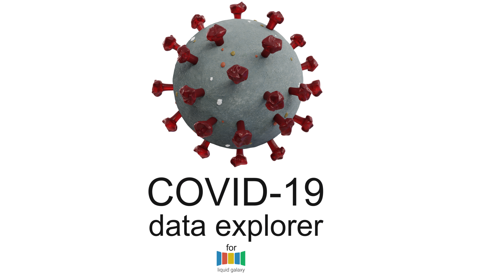

<p align="center">
  
</p>

### About

The project is a data visualizer about COVID 19, it aims to analyze the data obtained about the virus through the [Disease API](https://github.com/disease-sh/api) and [Athena API](https://www.who.int/data/gho/info/athena-api), process and show it in a Liquid Galaxy cluster. 
Thus, it will be possible for the user to filter the data about the virus and view its trajectory around the world.

### Getting started

Before continuing, make sure to have installed in your machine [Git](https://git-scm.com/) and [Flutter](https://flutter.dev). Read [Flutter documentation](https://docs.flutter.dev) for further information.

Then, clone the project:

```bash
$ git clone https://github.com/Na1au/COVID19_data_explorer.git
$ cd COVID19_data_explorer
```

With the project cloned, run it by using the following command:

> ❗ You must have a mobile device connected or an android emulator running in order to run the app.

```bash
$ flutter run
```

### Building the app

In order to have a installed version of the app, you may run the command below:

```bash
$ flutter build apk --release
```

> The `--release` flag is optional as it generates a final version of the application that can be tested in a real android service.

Once done, the APK file may be found into the `/build/app/outputs/flutter-apk/` directory, named `app-release.apk`.

### Connecting to the Liquid Galaxy

With the app opened, a cog button (⚙️) may be seen into the home page toolbar (top right corner). When clicked, it will lead you to the settings page, in which a form may be found.

Fill it up with the Liquid Galaxy IP address, host name, password, and total machines number in the Liquid Galaxy RIG.

After done, click into the `Connect to LG` button and check whether the `Connection status` changes to `Connected`, in case it doesn't, there's something wrong with the given information or your device connection.

Once connected, head back to the home page and use the app as you wish. Note that all data is kept in local storage after the first load and updated whenever used data is updated in API.
The data of the "new" category is updated every day and the day is reset after midnight GMT+0.
The data of global statistics and total cases are updated every 10 minutes

### License

The COVID-19 data explorer is licensed under the [MIT license](https://opensource.org/licenses/MIT).

### Privacy Policy and Terms & Conditions

Check out our [Privacy Policy](https://github.com/Na1au/COVID19_data_explorer/blob/main/PrivacyPolicy.md) to see more information about the application.
